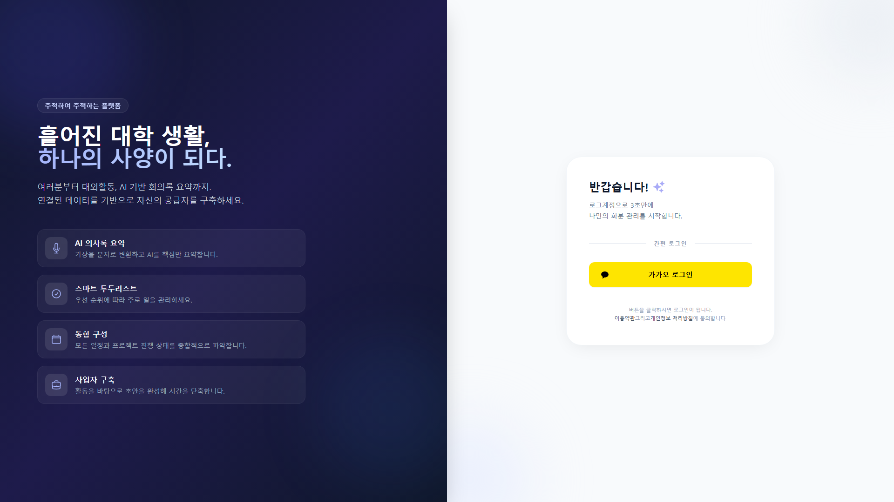
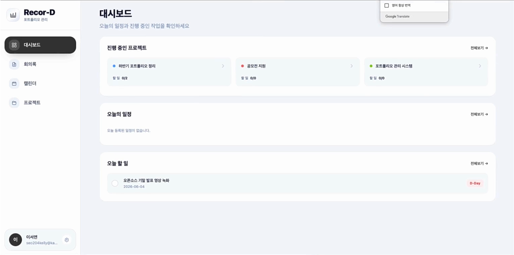
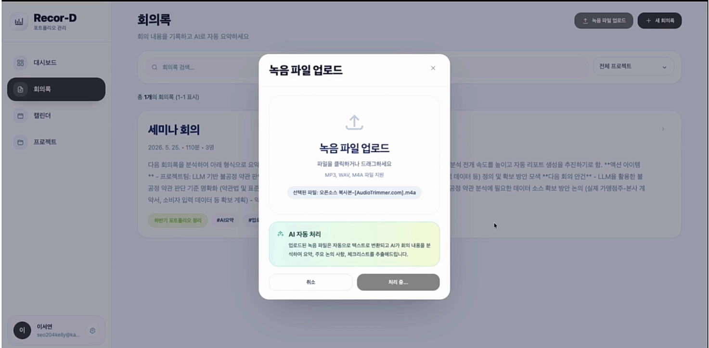
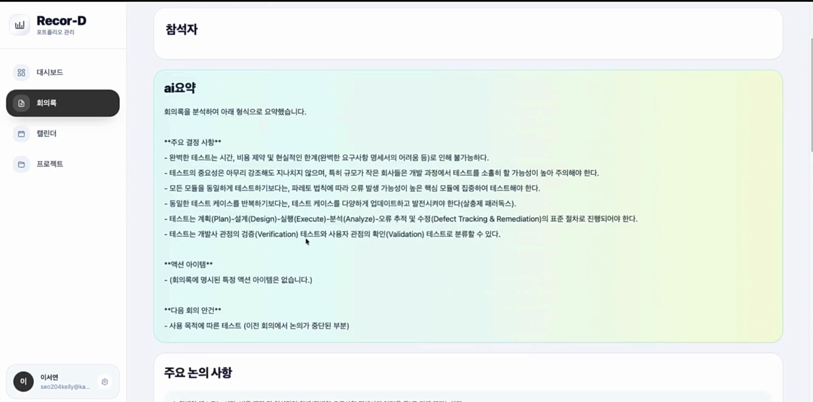
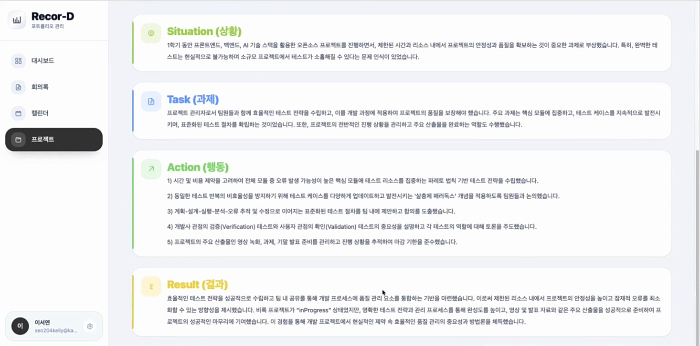

# RecorD — 프로젝트 기록 관리 & 포트폴리오 자동 생성 서비스

> 회의록·할 일·일정을 프로젝트 단위로 기록하고, AI가 STAR 기법 기반의 포트폴리오 초안을 자동으로 생성해주는 서비스의 프론트엔드 레포지토리입니다.


> **백엔드 레포지토리:** [RecorD_BE](https://github.com/jyeong479/Recor_D-BE)

---

## 화면 구성

| 로그인 | 대시보드 |
|--------|----------|
|  |  |

| 회의록 음성 업로드 | 회의록 AI 요약 |
|-------------------|----------------|
|  |  |

| 포트폴리오 STAR 결과 |
|---------------------|
|  |

---

## 주요 기능

| 페이지 | 기능 |
|--------|------|
| **로그인** | 카카오 소셜 로그인, OAuth 2.0 콜백 처리 |
| **대시보드** | 프로젝트·할 일·일정 현황 한눈에 보기 |
| **회의록** | 회의록 목록 조회·작성, 음성 파일 업로드 후 STT 변환, AI 요약 결과 확인 |
| **캘린더** | 일정 및 할 일 캘린더 뷰 |
| **프로젝트** | 프로젝트 생성·관리, AI 포트폴리오 초안 자동 생성 및 결과 확인 |
| **설정** | 계정 설정 |

---

## 기술 스택

- **React 19** / **React Router 7**
- **TailwindCSS 3** — 스타일링
- **Axios** — API 통신
- **JWT** — Access Token 기반 인증 (localStorage 관리)

---

## 프로젝트 구조

```
src/
├── pages/
│   ├── LoginPage/         # 카카오 로그인
│   ├── KakaoCallback/     # OAuth 콜백 처리
│   ├── MainShell/         # 레이아웃 쉘, 대시보드, 설정
│   ├── MeetingNotes/      # 회의록 목록·작성·음성 업로드·AI 요약
│   ├── Calendar/          # 캘린더 뷰
│   └── Project/           # 프로젝트 관리·포트폴리오 생성
├── components/
│   ├── Sidebar/           # 사이드바 네비게이션
│   ├── ProtectedRoute/    # 인증 라우트 가드
│   └── KakaoButton/       # 카카오 로그인 버튼
└── utils/
    ├── auth.js            # 토큰 저장·조회·삭제
    └── dateUtils.js       # 날짜 포맷 유틸
```

---

## 로컬 실행

```bash
# 1. 의존성 설치
npm install

# 2. 환경변수 설정
# .env 파일 생성 후 백엔드 API 주소 입력
REACT_APP_API_BASE_URL=http://localhost:8000

# 3. 개발 서버 실행
npm start
```
